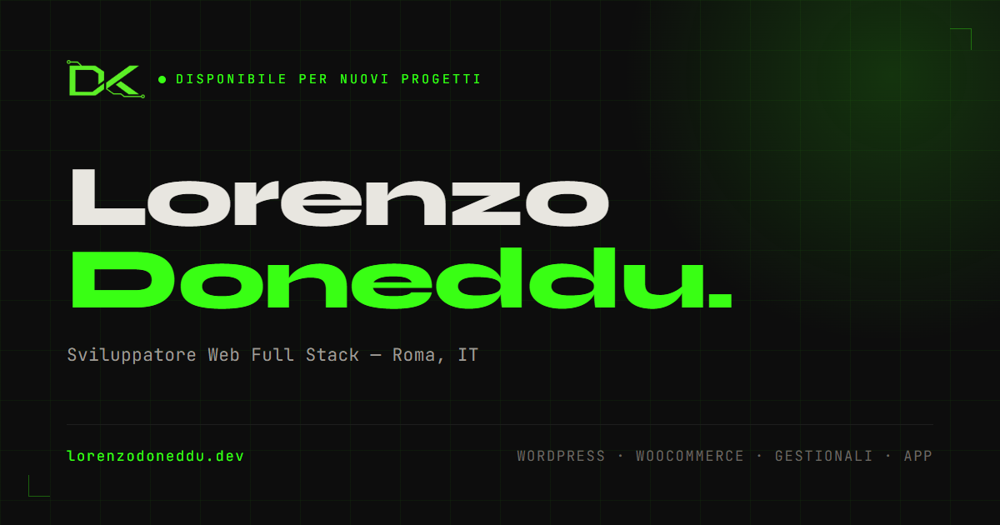

# lorenzodoneddu.dev

Portfolio personale — sviluppato da zero, senza framework né page builder.

🔗 **Live:** [lorenzodoneddu.dev](https://lorenzodoneddu.dev/)



## Cos'è

Sito vetrina one-page per presentare percorso, competenze e servizi come sviluppatore
web full stack. Nessun CMS, nessun framework JS: HTML/CSS/JS scritti a mano, con GSAP
per le animazioni e una serverless function su Vercel per il form contatti.

L'obiettivo, oltre a presentarmi, è mostrare come lavoro: cura dei dettagli,
accessibilità, performance e attenzione a cosa succede davvero nel browser (non solo
"funziona sul mio schermo").

## Stack

- **HTML5 / CSS3** — nessun preprocessore, custom properties per il design system
  (colori, font, spaziature)
- **JavaScript vanilla (ES6+)** — nessun framework, DOM API dirette
- **[GSAP](https://gsap.com/) + ScrollTrigger** — animazioni e interazioni scroll-driven
- **Vercel Serverless Functions** — endpoint `/api/contact` (Node runtime, zero dipendenze
  npm oltre a `fetch` nativa)
- **[Resend](https://resend.com/)** — invio email dal form contatti
- **Vercel Web Analytics**

## Cose degne di nota per chi legge il codice

- **Form contatti robusto**: honeypot anti-bot, rate limiting per IP, validazione sia
  client che server, tracciamento del consenso privacy (art. 7 GDPR) direttamente
  nell'email inviata — vedi [`api/contact.js`](api/contact.js)
- **Icone SVG via `<symbol>`/`<use>`**: sostituite ai caratteri Unicode iniziali, che su
  iOS venivano renderizzati come emoji a colori invece che come glifi — vedi i commenti
  in [`index.html`](index.html)
- **Layout responsive "a binari"**: su mobile le card delle skill scorrono in rail
  orizzontali con scroll-snap, su desktop diventano grid — stesso markup, CSS diverso
- **Animazioni scroll-driven** con GSAP/ScrollTrigger: intro loader, timeline
  esperienze, contatori animati, cursore custom, effetti magnetici sui bottoni
- **`prefers-reduced-motion`** rispettato ovunque le animazioni non siano essenziali
- **SEO/social**: JSON-LD (schema.org Person), Open Graph, Twitter Card, sitemap,
  robots.txt
- **URL senza estensione**: `cleanUrls` + `trailingSlash` in
  [`vercel.json`](vercel.json) servono `/privacy-policy/` e redirigono in 308
  permanente sia i vecchi `.html` sia la variante senza slash, così i link già
  indicizzati non si rompono e ogni pagina ha una sola forma canonica. Tutti i
  percorsi degli asset sono assoluti dalla root: con lo slash finale la base degli
  URL relativi cambia, e un `css/style.css` si romperebbe
- **CSS per pagina**: il foglio unico è diviso in `base` (condiviso) + `home` +
  `legal`; le pagine legali scendono da ~56 KB a ~14 KB di CSS, e `base.min.css`
  resta in cache passando dalla home alle policy
- **Privacy & Cookie Policy** proprie, checkbox di consenso collegata alla validazione
  nativa del form

## Struttura

```
├── index.html              # pagina principale (hero, about, skills, esperienze, servizi, contatti)
├── privacy-policy.html     # servita come /privacy-policy/
├── cookie-policy.html      # servita come /cookie-policy/
├── vercel.json             # cleanUrls + trailingSlash
├── api/
│   └── contact.js          # serverless function: form contatti → Resend
├── css/
│   ├── base.css            # condiviso: reset, token, sfondo, footer
│   ├── home.css            # solo index.html
│   ├── legal.css           # solo pagine legali
│   └── *.min.css           # serviti in produzione
├── js/
│   ├── script.js           # sorgente
│   ├── script.min.js       # servito in produzione
│   ├── gsap.min.js
│   └── ScrollTrigger.min.js
└── assets/
    ├── fonts/
    └── images/
```

## Sviluppo locale

Nessuna build necessaria per il markup/CSS/JS: basta servire la cartella con un
server statico (es. Live Server) e aprire `index.html`.

```bash
npm install   # solo per terser, usato per minificare js/script.js
```

Il form contatti (`api/contact.js`) richiede l'ambiente Vercel (`vercel dev`) e una
`RESEND_API_KEY` valida per funzionare end-to-end; in locale senza queste variabili
la pagina resta comunque completamente navigabile.

## Deploy

Hosting su [Vercel](https://vercel.com/), deploy automatico da `master`.

## Autore

**Lorenzo Doneddu** — Sviluppatore Web Full Stack, Roma
[GitHub](https://github.com/donnykDEV) · [LinkedIn](https://www.linkedin.com/in/lorenzo-doneddu-4767a5242/) · [lorenzodoneddudev@gmail.com](mailto:lorenzodoneddudev@gmail.com)
